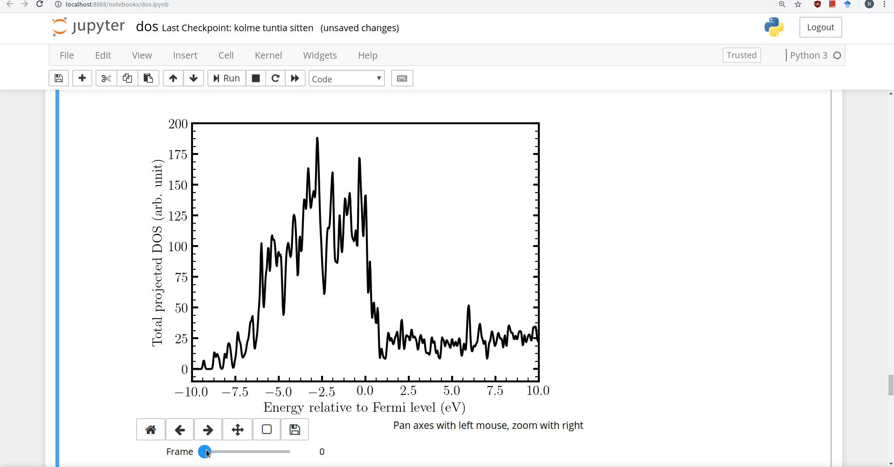
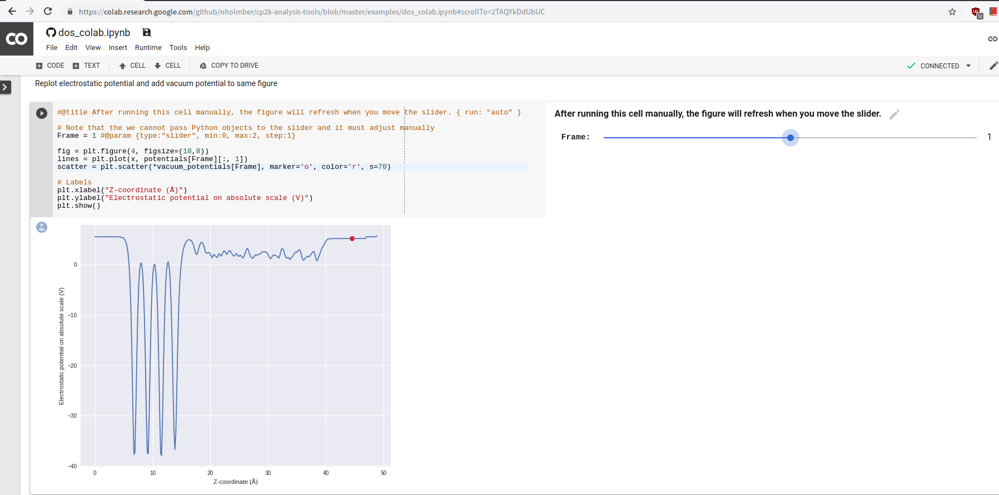

# Analysis Tools for CP2K Simulations

This repository contains Python-based analysis tools to process results from density functional theory simulations. I've used these scripts mainly to process results from simulations with the [CP2K](https://cp2k.org) software, but you can use the scripts with your favorite simulation code as long as you preprocess the data appropriately.

The following scripts are included (see folder [src](https://github.com/nholmber/cp2k-analysis-tools/tree/master/src)):
* [`dos.py`](https://github.com/nholmber/cp2k-analysis-tools/blob/master/src/dos.py)
	* Analyze properties related to the system's density of states (DOS) and electrode potential.
* [`potential.py`](https://github.com/nholmber/cp2k-analysis-tools/blob/master/src/potential.py)
	* Tool to process one- or two-dimensional potential energy surfaces.

You can find Jupyter notebooks in the [examples](https://github.com/nholmber/cp2k-analysis-tools/tree/master/examples) directory, which show you how to use the scripts and highlight their features. The notebooks are compatible with [Google Colaboratory](https://colab.research.google.com/), which is a cloud-based environment where you can run notebooks if you don't want to install the Python/Jupyter dependencies on your own computer.

The notebooks appended with the suffix `_colab` are intended for use with Google Colaboratory. You can open them in a browser by modifying the notebook GitHub URL to point to Google Colaboratory like this:

[https://colab.research.google.com/github/nholmber/cp2k-analysis-tools/blob/master/examples/dos_colab.ipynb](https://colab.research.google.com/github/nholmber/cp2k-analysis-tools/blob/master/examples/dos_colab.ipynb)

Alternatively, you may open the notebooks from the main [Google Colaboratory](https://colab.research.google.com/) website by selecting `File -> Open -> GitHub` and searching this repository by name/username. Feel free to check out [this post](https://nholmber.github.io/2018/09/google-colab/) if you want to learn more about Google Colaboratory.